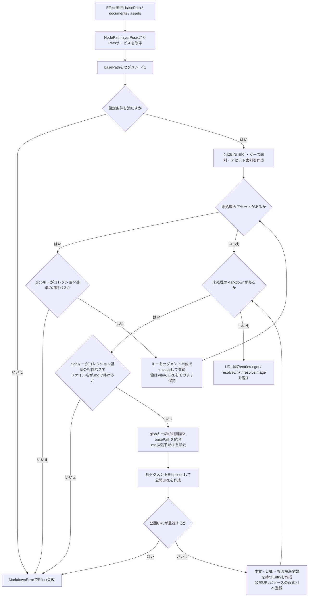
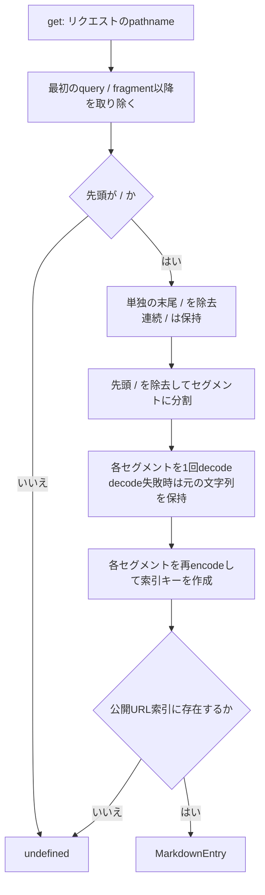
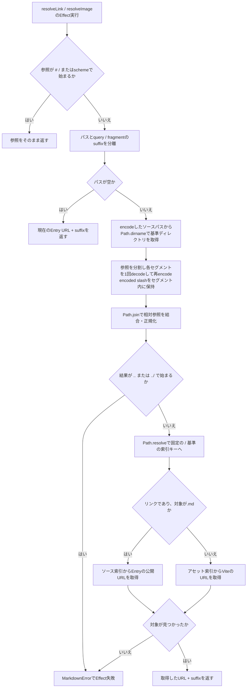

# Markdown implementation

## Purpose

The collection separates source paths from public URLs: Vite loads files, the collection resolves their references, and Comark parses and renders their contents.
For setup, use [the package README](../README.md), [the consumer guide](GUIDE.md), or [`examples/markdown`](../../../examples/markdown).

## Responsibilities

Vite discovers documents with `import.meta.glob` and imports their contents with `?raw`.
Using the same glob `base` gives document and asset keys a shared reference directory.
Vite also resolves assets with `?url` and owns their development URLs, production emission, and hashing.
The Markdown package consumes those maps rather than implementing a filesystem loader, asset copier, or bundler.

The package maps source files to application URLs while preserving directory hierarchy.
For example, the keys `./manual.md` and `./manual/guide/deep/details.md` map to `/manual` and `/manual/guide/deep/details` when `basePath` is `/`.
Removing only `.md` keeps directory and file names distinct: `guide.md` becomes `/guide`, while `guide/index.md` becomes `/guide/index`.
Relative document links resolve from their containing source file and retain queries and fragments.
Asset references use URLs supplied by Vite.
Source-relative path operations use Effect's [`NodePath.layerPosix`](https://effect.website/docs/v4/api/platform-node-shared/NodePath), keeping Vite's slash-separated paths consistent across hosts.
The runtime must support `node:path` and `node:url`; the Workers example enables `nodejs_compat`.

`createMarkdownCollection`, `parseMarkdown`, and URL resolvers expose expected failures through `MarkdownError` in Effect's error channel.
Collection entries and `get` remain ordinary values and lookup operations.
A missing document is a lookup miss, allowing the application's catch-all middleware to return 404 before streaming.
Collection lookup preserves segment boundaries and decodes each URL segment once, including literal percent filenames.

## collection.ts の処理フロー

対象: [`packages/markdown/src/collection.ts`](../src/collection.ts)。
このファイルはViteが読み込んだ文字列・アセットURLを索引化します。
Markdownの構文解析とReact描画は別の処理です。

### 1. コレクション生成

`createMarkdownCollection(options)`はEffectを返し、以下の処理はそのEffectを実行したときに行われます。
`documents`は`?raw`の文字列マップ、`assets`は`?url`のURLマップです。

設定確認では、`basePath`が`/`で始まり、query・fragment・`..`セグメントを含まないことを確認します。
globキーは`./`で始まるコレクション基準の相対パスとして扱い、`..`による基準外参照や`.md`だけのファイル名は受け付けません。
`Entry.source`は診断と相対リンク解決用のキーとして残りますが、読み込みディレクトリの指定ではありません。
例: `basePath: "/manual"`とglobの`base: "./content"`で、`./guide.md` → `/manual/guide`、`./guide/start.md` → `/manual/guide/start`。

### 2. リクエストURLからEntryを検索

`get(pathname)`は同期的なMap検索で、Effectではありません。
見つからない場合は`undefined`を返し、404にする判断は呼び出し側が担当します。

分割してからdecodeするため、セグメント内のencoded slashがディレクトリ境界へ変わることはありません。
ファイル名が文字列として`%20`を含む場合も、URLの`%2520`を二重decodeせず検索します。

### 3. Markdown内のリンク・画像参照を解決

`resolveLink`と`resolveImage`は共通の`resolveLocal`を使うEffectです。
前者はMarkdownファイルをページURLへ解決でき、後者はアセット索引だけを使います。

外部URLやルート相対URLのポリシーはComark・アプリケーション側に委譲します。
アセットの読み込み・変換・出力はViteの担当で、この処理は渡されたURLを検索するだけです。
suffixは文字列として末尾へ追加し、既存URLのqueryを再構成・マージしません。

## Rendering

Parsing retains Comark's standard defaults and adds the mdts plugins for footnotes, math, Mermaid with Tokyo Night, and Shiki.
`parseMarkdown` prepares a Comark document and resolves link/image attributes before rendering.
Applications import Comark's standard `MarkdownDocument` directly and supply their own component mappings.
The package provides no React renderer factory, forced component mappings, or custom Math/Mermaid SSR replacements.

Content and plugins are trusted authored inputs.
This integration is not a sanitizer for untrusted submissions.
Standard Comark document rendering does not automatically register its separate Math/Mermaid components; rich no-JavaScript rendering is tracked in [the roadmap](../../../docs/ROADMAP.md#standard-rendering-and-deferred-rich-ssr).

## Verification

For package checks and unit coverage, use the [package development instructions](../AGENTS.md).
For rendered Markdown and asset behavior, use [built-artifact acceptance](../../../docs/TESTING.md).
For document edits, additions, and deletion, use [development HMR acceptance](../../../docs/TESTING.md).

Typed metadata, relationships, loaders, and richer SSR support remain separate [roadmap items](../../../docs/ROADMAP.md).
