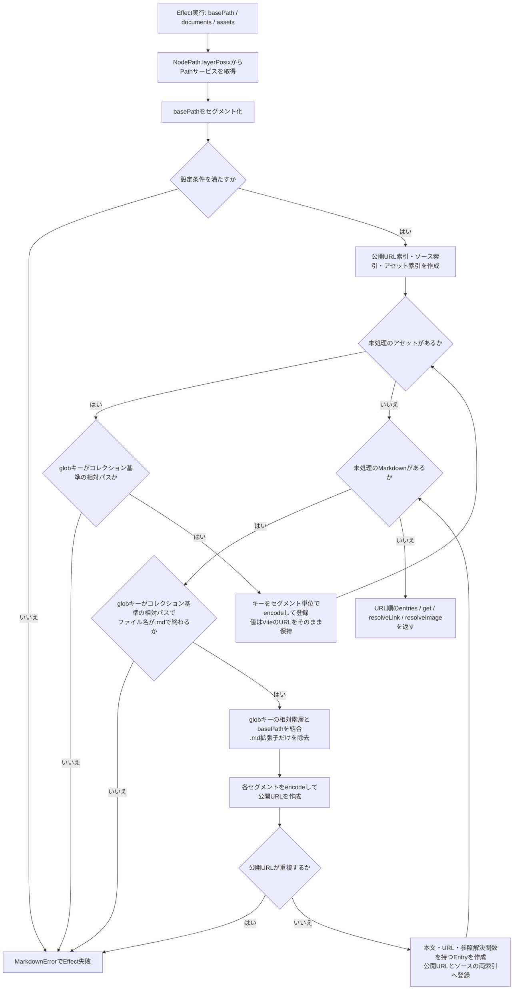
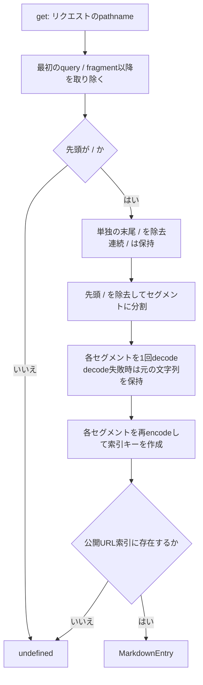
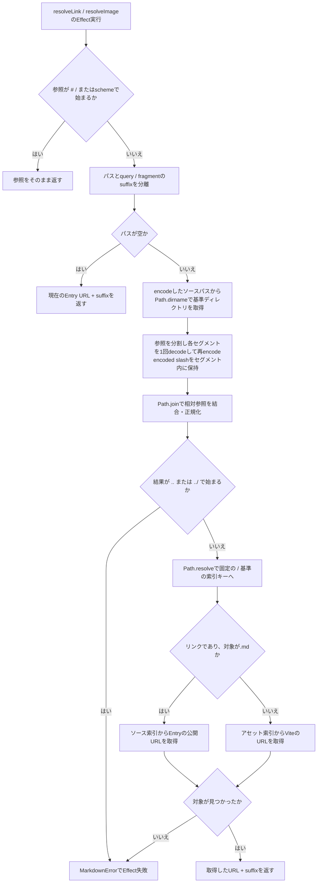

# Markdown implementation

## Purpose

This document explains the collection's indexes, resolution algorithm, rendering graphs, and build artifacts for maintainers.
Consumer contracts live in the [English API reference](../../../app/docs/src/content/en/articles/api-reference/markdown.md) and its [Japanese translation](../../../app/docs/src/content/articles/api-reference/markdown.md).

## Responsibilities

Vite owns file discovery and asset emission.
The collection consumes loaded maps rather than implementing a runtime filesystem loader, asset copier, or bundler.
Source-relative path operations use Effect's [`NodePath.layerPosix`](https://effect.website/docs/v4/api/platform-node-shared/NodePath) so slash-separated Vite keys have host-independent semantics.
The source index and public URL index remain separate: reference resolution needs source filenames, while request lookup needs encoded public routes.

## collection.ts の処理フロー

対象: [`packages/markdown/src/collection.ts`](../src/collection.ts)。
このファイルはViteが読み込んだ文字列・アセットURLを索引化します。
Markdownの構文解析とReact描画は別の処理です。

### 1. コレクション生成

`createMarkdownCollection(options)`はEffectを返し、以下の処理はそのEffectを実行したときに行われます。
`documents`は`?raw`の文字列マップ、`assets`は`?url`のURLマップです。

`Entry.source` remains the source-index key used by diagnostics and relative resolution, not a filesystem loading instruction.

### 2. リクエストURLからEntryを検索

`get(pathname)`は公開 URL 索引を同期的に検索します。

分割してからdecodeするため、セグメント内のencoded slashがディレクトリ境界へ変わることはありません。
ファイル名が文字列として`%20`を含む場合も、URLの`%2520`を二重decodeせず検索します。

### 3. Markdown内のリンク・画像参照を解決

`resolveLink`と`resolveImage`は共通の`resolveLocal`を使うEffectです。
前者はMarkdownファイルをページURLへ解決でき、後者はアセット索引だけを使います。

外部URLやルート相対URLのポリシーはComark・アプリケーション側に委譲します。
アセットの読み込み・変換・出力はViteの担当で、この処理は渡されたURLを検索するだけです。
suffixは文字列として末尾へ追加し、既存URLのqueryを再構成・マージしません。

## Rendering

`parseMarkdown` resolves link/image attributes after the parser plugins, keeping URL resolution independent from rendering.
`@effront/markdown/document` wraps Comark's direct document-rendering entry point with configurable defaults and an `effront-markdown` wrapper class.
It does not import the collection/parser entry point or make the whole article a Client Component.
Only the Math and Mermaid wrappers carry `use client`; they reuse Comark's default components and keep the Mermaid dependency out of the SSR graph.
Mermaid uses [`use(browser())`](https://react.dev/reference/react-dom/browser) inside a `Suspense` boundary to leave its fallback on the server, then [`lazy`](https://react.dev/reference/react/lazy) loads the upstream component in the browser.
React manages loading and retries instead of a wrapper-owned Effect and mounted state.
The document wrapper merges its default component mappings with the caller's mappings using object spread and leaves component resolution to Comark.
The library build copies KaTeX's local fonts and license beside the emitted stylesheet so its relative font URLs survive package publication.
The wrappers do not filter themes, rewrite SVG styles or IDs, or replace upstream invalid-input behavior.

Ordinary prose stays in the server-rendering graph.
Math starts as `...` and Mermaid as an empty container until client effects run; rich no-JavaScript rendering remains deferred in [the roadmap](../../../docs/ROADMAP.md#standard-rendering-and-deferred-rich-ssr).

## Verification

For package checks and unit coverage, use the [package development instructions](../AGENTS.md).
For rendered Markdown and asset behavior, use [built-artifact acceptance](../../../docs/TESTING.md).
For document edits, additions, and deletion, use [development HMR acceptance](../../../docs/TESTING.md).

Typed metadata, relationships, loaders, and richer SSR support remain separate [roadmap items](../../../docs/ROADMAP.md).
