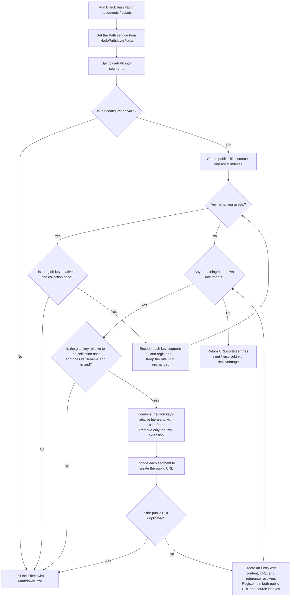
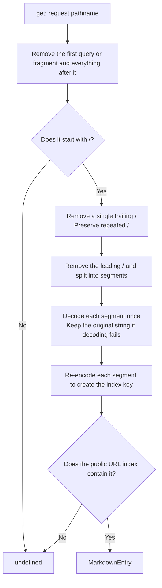
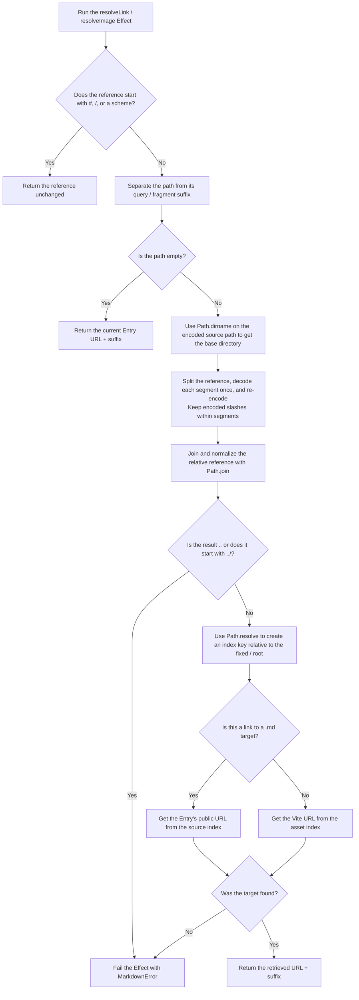

# Markdown implementation

## Purpose

This document explains the collection's indexes, resolution algorithm, rendering graphs, and build artifacts for maintainers.
Consumer contracts live in the [API reference](../../../app/docs/src/content/en/articles/api-reference/markdown.md).

## Responsibilities

Vite owns file discovery and asset emission.
The collection consumes loaded maps rather than implementing a runtime filesystem loader, asset copier, or bundler.
Source-relative path operations use Effect's [`NodePath.layerPosix`](https://effect.website/docs/v4/api/platform-node-shared/NodePath) so slash-separated Vite keys have host-independent semantics.
The source index and public URL index remain separate: reference resolution needs source filenames, while request lookup needs encoded public routes.

## collection.ts processing flow

Source: [`packages/markdown/src/collection.ts`](../src/collection.ts).
This file indexes strings and asset URLs loaded by Vite.
Markdown parsing and React rendering are separate operations.

### 1. Create a collection

`createMarkdownCollection(options)` returns an Effect, and the following steps run when that Effect executes.
`documents` is a map of `?raw` strings, and `assets` is a map of `?url` URLs.

`Entry.source` remains the source-index key used by diagnostics and relative resolution, not a filesystem loading instruction.

### 2. Look up an Entry by request URL

`get(pathname)` synchronously searches the public URL index.

Splitting before decoding prevents encoded slashes within segments from becoming directory boundaries.
Filenames containing the literal string `%20` are looked up without decoding the URL's `%2520` twice.

### 3. Resolve links and image references in Markdown

`resolveLink` and `resolveImage` are Effects that share `resolveLocal`.
The former can resolve Markdown files to page URLs, while the latter uses only the asset index.

Comark and the application own the policy for external and root-relative URLs.
Vite owns asset loading, transformation, and emission, and this operation only looks up the supplied URLs.
The suffix is appended as a string without reconstructing or merging the existing URL's query.

## Rendering

`parseMarkdown` resolves link/image attributes after the parser plugins, keeping URL resolution independent from rendering.
`@effront/markdown/document` wraps Comark's direct document-rendering entry point with configurable defaults and an `effront-markdown` wrapper class.
It does not import the collection/parser entry point or make the whole article a Client Component.
Only the Math and Mermaid wrappers carry `use client`; they reuse Comark's default components and keep the Mermaid dependency out of the SSR graph.
Mermaid uses [`use(browser())`](https://react.dev/reference/react-dom/browser) inside a `Suspense` boundary to leave its fallback on the server, then [`lazy`](https://react.dev/reference/react/lazy) loads the upstream component in the browser.
React manages loading and retries instead of a wrapper-owned Effect and mounted state.
The document wrapper merges its default component mappings with the caller's mappings using object spread and leaves component resolution to Comark.
The library build copies KaTeX's local fonts and license beside the emitted stylesheet so its relative font URLs survive package publication.
The wrappers do not filter themes, rewrite SVG styles or IDs, or replace upstream invalid-input behavior.

Ordinary prose stays in the server-rendering graph.
Math starts as `...` and Mermaid as an empty container until client effects run; rich no-JavaScript rendering remains deferred in [the roadmap](../../../docs/ROADMAP.md#standard-rendering-and-deferred-rich-ssr).

## Verification

For package checks and unit coverage, use the [package development instructions](../AGENTS.md).
For rendered Markdown and asset behavior, use [built-artifact acceptance](../../../docs/TESTING.md).
For document edits, additions, and deletion, use [development HMR acceptance](../../../docs/TESTING.md).

Typed metadata, relationships, loaders, and richer SSR support remain separate [roadmap items](../../../docs/ROADMAP.md).
