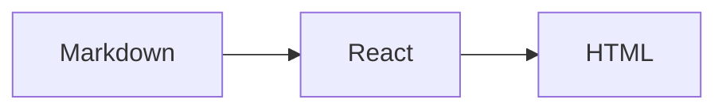
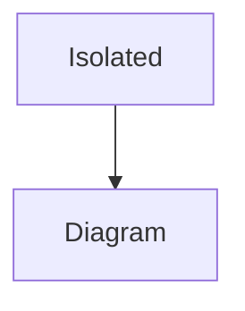

# Markdown manual

This page is rendered on the server with comark's React integration.

- [Getting started](./manual/guide/getting-started.md?from=manual#installation)
- [Deep details](./manual/guide/deep/details.md)
- [Unicode page](./manual/guide/日本語%20space.md?from=manual#details)
- [External reference](https://example.com/reference?q=markdown#section)
- [Local section](#features)


## Features

A reference with a footnote.[^detail]

[^detail]: Footnote detail

Inline mathematics: $E = mc^2$.

$$
a^2 + b^2 = c^2
$$





Invalid inline mathematics: $\not-a-katex-command{$.

```mermaid
This is not a Mermaid diagram.
```

```typescript
const message: string = "Hello Markdown";
```

| Feature    | Status   |
| ---------- | -------- |
| SSR        | Ready    |
| File links | Resolved |

- [x] Preserve directory hierarchy
- [ ] Add a new document

> [!NOTE]
> Markdown links point to source files, not hand-written website routes.
